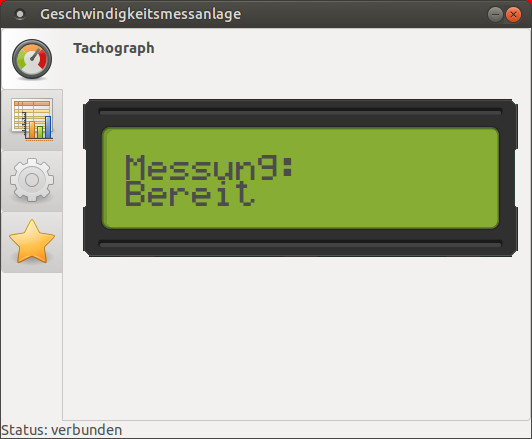

# Geschwindigkeitsmessanlage

Die Geschwindigkeitsmessanlage basiert auf der Entwicklung von Dominik Bugschat [Lokschuppen Dominik](https://www.lokschuppen-dominik.de/Spur%20H0/Bastelanleitungen/Geschwindigkeitsmessung/Seite.htm).

Diese Messanlage wurde um die serielle Kommunikation erweitert und in Python3 ein Programm erstellt, das die Anzeige spiegelt, sowie die Messwerte speichert.
Über ein Konfigurationsmenü ist es möglich, die Voreinstellungen der Messanlage zu verändern.
